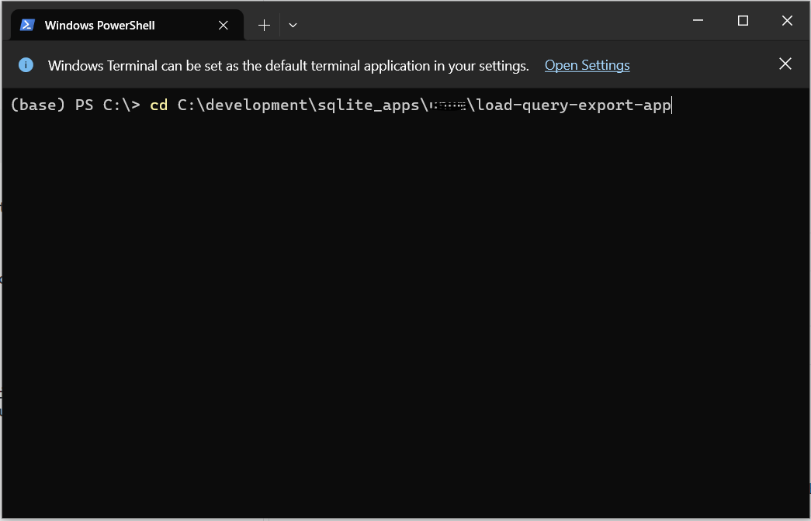

## Project Title

### Load, Query, and Export to Excel Using Python

## Project Description

This repository contains the source code to develop and build a fully functional Python console that loads csv files into SQLite DB, execute SQL from a text file, and save the results to Excel.

## Assumptions

I assume you are running this project on a Microsoft Windows PC. A built-in Windows tool like notepad.exe is used in this project to create and edit files. If you are developing on MAC OS or Linux, you can use vim.

```
notepad .gitignore
```

On Linux:

```
vim .gitignore
```


You can also use a modern code editor like VSCode to follow along with this course.


## How to Use the Project

You can clone this project and skip the step-by-step instructions to develop from scratch.

```
 git clone https://github.com/dareljohnson/load-query-export-app
```


## How to install and setup the project step-by-step

Requirements:

- pip v24.0
- pandas v2.2.1
- python v3.9


Optional:

- numpy v1.26.4
- DB Browser for SQLite v3.12.2 (https://sqlitebrowser.org/dl/)
- Anaconda (https://www.anaconda.com/download)


## Step-by-step instructions

On your Windows file system change directory to new project folder:

```
cd load-query-export-app
```

Create a virtual python enviroment (your_env_name):


Important!!!: Change the name of your_env_name to something else.


```
conda env create -f environment.yml
```

Activate the virtual enviroment:

```
conda activate your_env_name
```


Copy your csv files to the data_sets directory:

For example, copy the following csv files employess.csv and managers.csv to the data_sets directory.


Copy your prepared SQL statements (code) into the query.sql.txt file:


Open DB Browser for SQLite:

```
Create New Database
```


Name your SQLite database file and save it to the root of the project directory:


New database is created with empty Tables:


## How to Run the Project

Open up a Terminal window:




Chane directory to the local application:

```
cd load-query-export-app
```

Important!!!

Close the database in DB Browser for SQLite application.


Run the application:


This will create a new results.xlsx file in the results directory.


Open DB Browser for SQLite and Open the database file:


You can execute the same SQL query in the query.sql.txt or any other queries.


## Include Credits

N/A

## Contributing

Pull requests are welcome. For major changes, please open an issue first
to discuss what you would like to change.

Please make sure to update tests as appropriate.

## License
[MIT](https://choosealicense.com/licenses/mit/)
